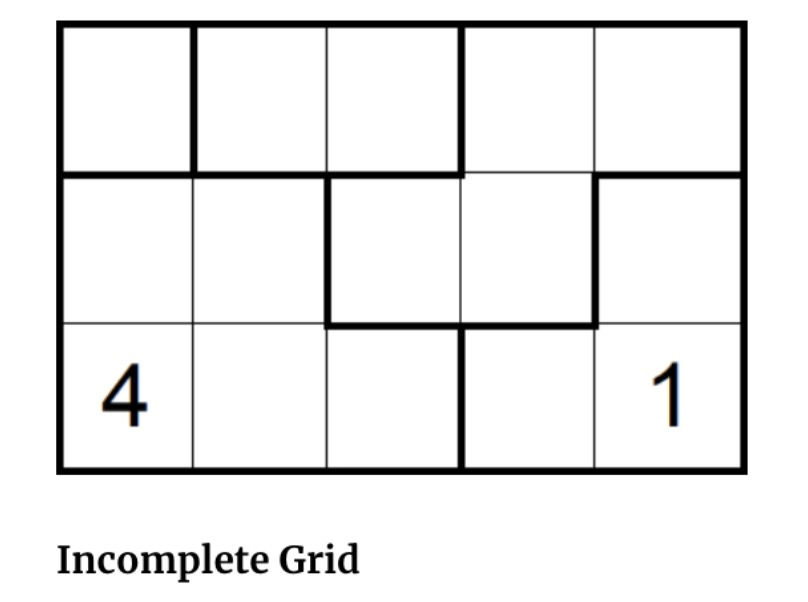

# complete search

Normally, in a sudoku, you are given a 9x9 grid with some cells filled with numbers and others with empty values. The normal job is to replace the empty cells with a digit, such the grid becomes valid. The grid is valid if every row, every column, and every 3x3 sub-grid contains exactly 9 distinct numbers (1 through 9) with no duplicate numbers. To make things a bit more interesting, for this question of the assignment, we will work on a modification of the sudoku game. As in Sudoku, this modification will place numbers in a grid (where the number of rows (R) and columns (C) will be in the following limits: 1 <= R,C <= 7); but this grid will not be constrained to size 9 x 9. Furthermore, the grid will have outlined regions (not constrained to be a 3x3 region as in the standard sudoku) that must contain the numbers from 1 to n, where n is the number of the cells (i.e., squares) in the region. The most interesting new feature comes from the fact that the same number can never touch itself, not even diagonally.

The figure below depicts the initial incomplete grid and the grid with an accepted solution. Please note that this solution is unique (i.e., there is no other solution to the puzzle based on the described constrains). Furthermore, for this assignment, you are guaranteed that your solution will be tested against problems that have a unique solution.

|
