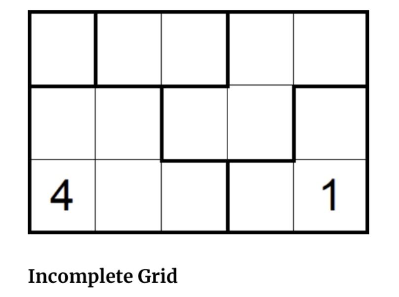
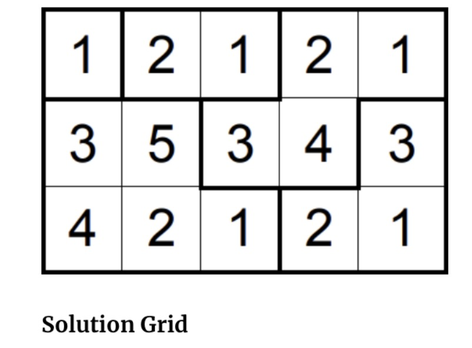

# 完全搜索

## 非标准数独

数独游戏通常有 9x9 的格子, 其中某些格子中有数字, 而其余的格子是空的. 游戏规则是把那些空着的格子填上 1-9 的数字, 并且保证横行, 数列, 以及 3x3 的格子内有且仅有 1-9 这 9 个数字. 本问题稍作调整, 在 R 行, C列 (1 <= R,C <= 7) 的格子分为若干个区域, 每个区域有若干个格子, 区域是连通的, 不一定是标准的 3x3 的格子. 游戏规则是用 1-n 填充区域, 其中 n 是区域内格子数量, 并且要求相邻(包含对角相邻)的节点不能是相同数据.

下图展示了数独样例, 在初始情况下的数独以及在最终结果完成情况下的数独. 当然该问题有时无解(1x2 的格子分两个 1x1 的区域), 有时有多解( 1x4 的格子分 两个 1x2 的区域), 本问题只需要关注存在唯一解的数独, 只需要保证你的解就是那个唯一解即可.

|
--|--

## 解决方案

使用深度优先算法, 基于分区, 将尝试将合适数字填入位置并递归该过程. 当出现矛盾便往前回溯直至找到唯一满足游戏规则的解. 具体算法示意如下视频所示.

<video width="320" height="240" controls>
    <source src="pic/suduku.mov" type="video/mp4">
</video>
